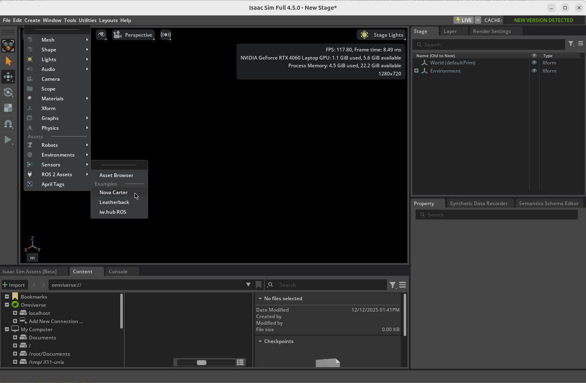
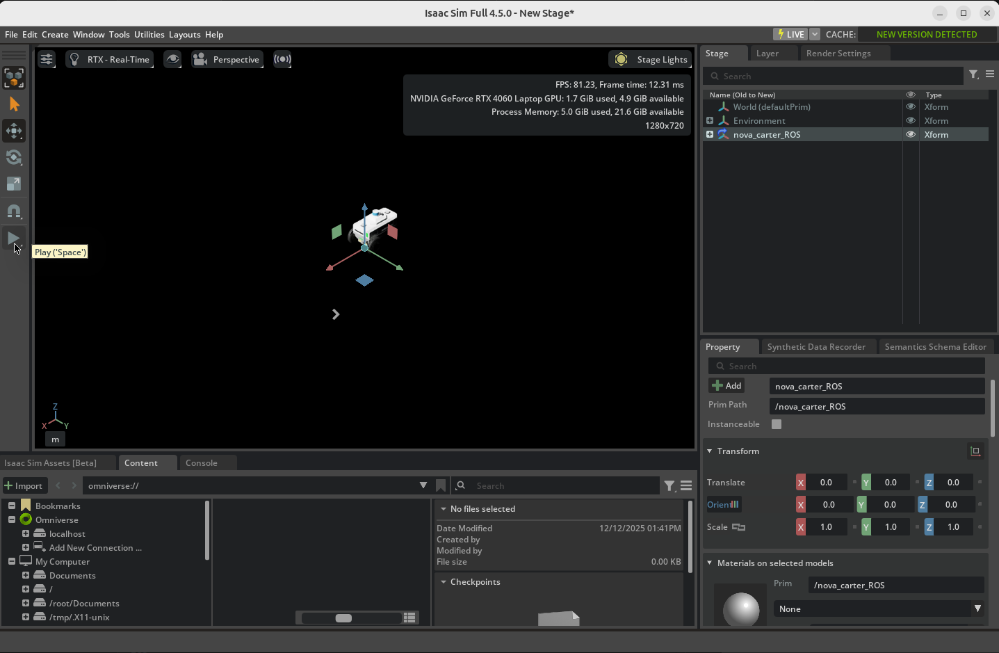
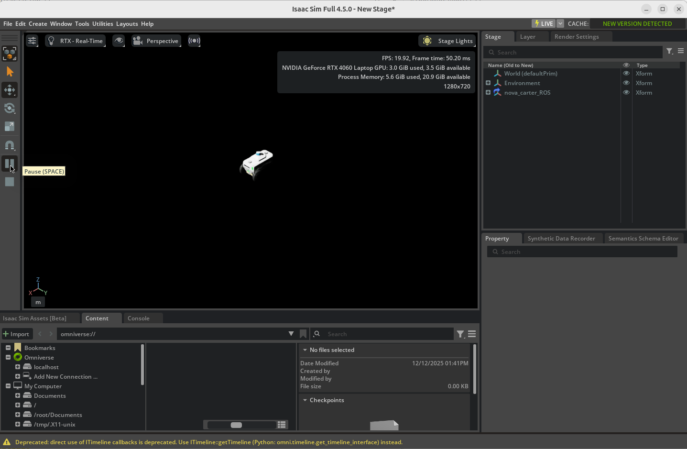
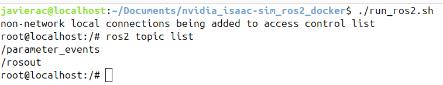
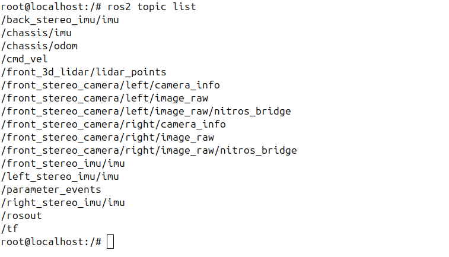

# nvidia_isaac-sim_5.1.0_ros2_docker (DISTRIBUTED)

<!-- Arrancar
./runapp.sh --enable omni.isaac.ros2_bridge -->

**Isaac Sim runs with warnings (``check warning.md``, for instance, to add a RTX Lidar you may need to add some configuration files. At the moment, this issue has not been resolved, and the .md file is only available in Spanish)**


Run NVIDIA Isaac Sim (NIS) 5.1.0 in a Docker container with ROS2 bridge already set up and communicating with another Docker container running the ROS2 Humble application.
Please, first af all check NIS_5-1-0 requiremente here: https://docs.isaacsim.omniverse.nvidia.com/5.1.0/installation/requirements.html. 

In this case, the Isaac Sim Docker image is the official one provided by NVIDIA, so no Dockerfile is included. However, the ROS2 image, although based on the official OSRF Docker image, requires additional configuration (the inclusion of a fastdds.xml profile) to enable communication with Isaac Sim. For this reason, a custom Dockerfile is provided for the ROS 2 container.

In the future, a link to my Docker Hub will also be published as a backup for both images, you never know what third parties might do with their repositories ;)

If you meet all the requirements, you can jump directly to [Download and run with bash scripts](#download-and-run-with-bash-scripts) to start developing!

NOTE: NIS 5.1.0 officially works with ROS2 Humble, but since the bridge is used to communicate topics, services, and actions, it will work in almost all cases with ROS2 Jazzy. The steps presented in this file correspond to ROS2 Humble, but the scripts correspond to Jazzy, so modify them according to your needs or preferences.
<br>

# Specifications
This repository has been run with the following host specifications:

OS: ``Ubuntu 24.04.X LTS``<br>
RAM: ``32 GB``<br>
Processor: ``13th Gen Intel® Core™ i7-13650HX × 20``<br>
Graphics card: ``NVIDIA Quadro RTX 5000``<br>
Graphics card memory: ``16 GB``<br>
NVIDIA-SMI dirvers version: ``580.95.05``<br>
CUDA version: ``13.0``<br>
Needed disk space: ``30 GB`` (rounded up)<br>

*It should work in previous releases as 20.04 and 22.04.
<br>

# Prerequisites
- NVIDIA Drivers installation: https://ubuntu.com/server/docs/nvidia-drivers-installation<br>
GPU drivers version must be 580.65.06 or later, check it with:
```bash
nvidia-smi
```

- NVIDIA Isaac Sim Requirements: https://docs.isaacsim.omniverse.nvidia.com/5.1.0/installation/requirements.html
Please ensure you meet the minimum requirements for NIS 5.1.0 before proceeding.

- Docker installation and executing without sudo:
```bash
curl -fsSL https://get.docker.com -o get-docker.sh
sudo sh get-docker.sh
```
```bash
# Post-install steps for Docker
sudo groupadd docker # Create group
sudo usermod -aG docker $USER # Add current user to docker group
newgrp docker # Log in docker group
```
```bash
#Verify Docker installation
docker run hello-world
```

- NVIDIA Container Toolkit installation:
```bash
# Configure the repository
curl -fsSL https://nvidia.github.io/libnvidia-container/gpgkey | sudo gpg --dearmor -o /usr/share/keyrings/nvidia-container-toolkit-keyring.gpg \
  && curl -s -L https://nvidia.github.io/libnvidia-container/stable/deb/nvidia-container-toolkit.list | \
    sed 's#deb https://#deb [signed-by=/usr/share/keyrings/nvidia-container-toolkit-keyring.gpg] https://#g' | \
    sudo tee /etc/apt/sources.list.d/nvidia-container-toolkit.list \
  && \
    sudo apt-get update

# Install the NVIDIA Container Toolkit packages
sudo apt-get install -y nvidia-container-toolkit
sudo systemctl restart docker

# Configure the container runtime
sudo nvidia-ctk runtime configure --runtime=docker
sudo systemctl restart docker

# Verify NVIDIA Container Toolkit
docker run --rm --runtime=nvidia --gpus all ubuntu nvidia-smi
```

- Create the cached volume mounts on host:
```bash
mkdir -p ~/docker/isaac-sim/cache/main/ov
mkdir -p ~/docker/isaac-sim/cache/main/warp
mkdir -p ~/docker/isaac-sim/cache/computecache
mkdir -p ~/docker/isaac-sim/config
mkdir -p ~/docker/isaac-sim/data/documents
mkdir -p ~/docker/isaac-sim/data/Kit
mkdir -p ~/docker/isaac-sim/logs
mkdir -p ~/docker/isaac-sim/pkg
sudo chown -R 1234:1234 ~/docker/isaac-sim
```

- Generate NGC API Key: https://docs.nvidia.com/ngc/ngc-overview/index.html#generating-api-key
- Log in to NGC:
```bash
docker login nvcr.io
```
```bash
Username: $oauthtoken
Password: <Your NGC API Key>
WARNING! Your password will be stored unencrypted in /home/username/.docker/config.json.
Configure a credential helper to remove this warning. See
credentials-store
Login Succeeded
```

- Activate NVIDIA GPU X Server (host running GUI with NVIDIA GPU instead of Intel/AMD one):
```bash
sudo prime-select nvidia
sudo reboot
```
This step is needed as Docker inherits X Server (GUI) from the host, any of the following will
fail in order to run NIS with NVIDIA GPU in Docker:
```bash
sudo prime-select intel
sudo prime-select on-demand
```
<br>

# Isaac Sim version
``5.1.0``
<br>

# ROS2 version
``ROS2 Humble Desktop``
<br>

# Docker version
``Client: Docker Engine - Community``<br>
``Version:           27.3.1``<br>
``API version:       1.47``<br>
``Go version:        go1.22.7``<br>
``Git commit:        ce12230``<br>
``Built:             Fri Sep 20 11:40:59 2024``<br>
``OS/Arch:           linux/amd64``<br>
``Context:           default``<br>

``Server: Docker Engine - Community``<br>
`Engine:`<br>
` Version:          27.3.1`<br>
` API version:      1.47 (minimum version 1.24)`<br>
`Go version:       go1.22.7`<br>
`Git commit:       41ca978`<br>
`Built:            Fri Sep 20 11:40:59 2024`<br>
`  OS/Arch:          linux/amd64`<br>
`  Experimental:     false`<br>
` containerd:`<br>
`  Version:          1.7.22`<br>
`  GitCommit:        7f7fdf5fed64eb6a7caf99b3e12efcf9d60e311c`<br>
` runc:`<br>
`  Version:          1.1.14`<br>
 ` GitCommit:        v1.1.14-0-g2c9f560`<br>
 `docker-init:`<br>
  `Version:          0.19.0`<br>
 ` GitCommit:        de40ad0`<br>
<br>

# Download images
```bash
docker pull osrf/ros:humble-desktop-full
docker pull nvcr.io/nvidia/isaac-sim:5.1.0
```
<br>

# Run containers
Allow running graphic interfaces in the container:
```bash
xhost +local:docker
```
Run the NIS container with the needed configuration:
```bash
xhost +local:docker
docker run --name nis-5.1.0-bare \
           --entrypoint bash \
           -it \
           --runtime=nvidia \
           --gpus all \
           -e DISPLAY=$DISPLAY \
           -e "ACCEPT_EULA=Y" \
           --rm --network=host \
           -e "PRIVACY_CONSENT=Y" \
           -e RMW_IMPLEMENTATION=rmw_fastrtps_cpp \
           -e LD_LIBRARY_PATH=$LD_LIBRARY_PATH:/isaac-sim/exts/isaacsim.ros2.bridge/jazzy/lib \
           -e NVIDIA_VISIBLE_DEVICES=all \
           -e NVIDIA_DRIVER_CAPABILITIES=graphics,utility,compute \
           -v /tmp/.X11-unix/:/tmp/.X11-unix/ \
           -v ~/docker/isaac-sim/cache/main:/isaac-sim/.cache:rw \
           -v ~/docker/isaac-sim/cache/computecache:/isaac-sim/.nv/ComputeCache:rw \
           -v ~/docker/isaac-sim/logs:/isaac-sim/.nvidia-omniverse/logs:rw \
           -v ~/docker/isaac-sim/config:/isaac-sim/.nvidia-omniverse/config:rw \
           -v ~/docker/isaac-sim/data:/isaac-sim/.local/share/ov/data:rw \
           -v ~/docker/isaac-sim/pkg:/isaac-sim/.local/share/ov/pkg:rw \
           -v ./projects:/isaac-sim/projects:rw \
           -u 1234:1234 \
           nvcr.io/nvidia/isaac-sim:5.1.0
```
The volume ```/isaac-sim/projects:rw``` is intended to be the working directory for NIS projects, the path where projects should be saved.

Run the ROS2 container with the needed configuration:
```bash
xhost +local:docker
docker run -e DISPLAY=$DISPLAY \
           -e USER=$USER \
           -e NVIDIA_VISIBLE_DEVICES=all \
           -e NVIDIA_DRIVER_CAPABILITIES=graphics,utility,compute \
           --runtime=nvidia \
           -v /tmp/.X11-unix/:/tmp/.X11-unix/ \
           --device /dev/dri:/dev/dri \
           -it \
           --rm \
           --network=host \
           --gpus all \
           --name ros2_humble \
           osrf/ros:humble-desktop-full
```

REMEMBER: if you want to share a folder between the host and the container, mount it adding the next flag to the previous command:
```bash
-v HOST_PATH:PATH_IN_CONTAINER
```
```bash
-v ~/Documents/isaac_sim/PROJECT_ID:~/PROJECT_ID
```
<br>

# Run Isaac Sim inside the container
If this command is included when running the container, ROS2 bridge will fail. That's because the container with ROS2 packages must be started first, and then Isaac Sim.
Once the container is running, type next line in the container:
```bash
./runapp.sh
```
Wait until Isaac Sim is completely loaded. Ignore "not responding" messages, it will take some time, so be patient ;).

If GUI fails to open, ensure that host's ```$DISPLAY``` variable is set to ``:0`` (and then rerun the NIS Docker image):
```bash
echo $DISPLAY 
```
<br>

# Download/build Docker images and run with bash scripts 

You can automatically execute the above process using the ```download_images.sh```, ```build_ros2.sh``` ```run_nis.sh```, ```run_ros2.sh``` and ```run.sh``` scripts.

Add execution permissions:
```bash
chmod u+x download_images.sh build_ros2.sh run_nis.sh run_ros2.sh run.sh
```

Download NIS image:
```bash
./download_images.sh
```

Build or download ROS2 Docker image adapted to NIS:
  - Build:
    ```bash
    ./build_ros2.sh
    ```
  
  - Download:
    ```bash
    ./docker pull arambarricalvoj/ros:jazzy-desktop-full_nis:latest
    ```

Run ROS2:
```bash
./run_ros2.sh
```

If you are using Tilix to manage multiple terminals on the same screen, open a Tilix terminal and run the following command. The NIS container will automatically open on the left and the ROS2 container on the right.
```bash
./run.sh
```
You can install Tilix easily:
```bash
sudo apt update && sudo apt install tilix -y
```
<br>

<!-- # (Pending better resolution) Mounting the ``projects/`` volume with proper permissions
When running Isaac Sim inside Docker, files created in the mounted ``projects/`` directory may end up with incorrect ownership or restrictive permissions on the host.

Use a shared group and allow group write access. In this method, both the host user and the Docker container share the same group (GID 1234). Files created inside the container will inherit this group and be writable by both sides. 

  1. Create a group with GID 1234 and add your host user to it:
  ```bash
  sudo groupadd -g 1234 isaac_sim
  sudo usermod -aG isaac_sim $USER
  newgrp isaac_sim
  ```

  2. Change the group ownership of the projects/ directory:
  ```bash
  sudo chgrp -R isaac_sim ./projects
  ```

  3. Ensure the group can write to the directory and that new files inherit the group:
  ```bash
  sudo chmod -R g+rw ./projects
  sudo chmod g+s ./projects # Optional
  ```

  4. Finally, if you want to read those project files in the host (or to push to GitHub) change the owner and add permissions (in the host):
  ```bash
  sudo chown $USER -R project/
  sudo chmod -R u+rwx project/
  sudo chmod -R g+rwx project/
  ```

  This ensures that once the files are created, they are accessible and can be manipulated from both the host and the Docker container. However, when Isaac Sim generates the file, you will need to manually give permissions to the group as in step 4. Be careful! If the owner of the group is changed, Isaac Sim's Docker container will not be able to read the files, hence the need to create the group. At the moment, no better solution has been found (``-u 1000:1234`` has been tried, but when running Isaac Sim from a Python file, it gave permission errors in the host's shared folders ``~/docker/isaac-sim/*``, pending resolution). 
<br> -->

<!-- - Use a excesively permissive umask so "Other" can read and write the file. Add the following flag to ``docker run`` command:
  ```bash
  -c "umask 0000 && bash"
  ```
  Those permissions are (for files):
  ```
  u=rw-, g=rw-, o=rw-
  ```
  Those permissions are (for directories):
  ```
  u=rwx, g=rwx, o=rwx
  ```
<br> -->

# (Recommended solution, optional) Matching host user UID/GID with the NVIDIA Isaac Sim Docker container
When running Isaac Sim inside Docker, files created inside the mounted `projects/` directory inherit the **UID and GID of the user inside the container**.  
NVIDIA's Isaac Sim images typically run as a user with:
- **UID = 1234**
- **GID = 1234**

If the host user has a different UID/GID (e.g., the default 1000:1000), files created by Isaac Sim will appear on the host as belonging to an *unknown user*, causing:
- permission denied errors  
- inability to edit or delete files without `sudo`  
- Git refusing to stage or commit files  
- VS Code failing to save changes  
- broken workflows when mixing host and container operations  

To avoid these issues, the most robust solution is to **create a host user whose UID and GID match those of the Isaac Sim container**. This ensures that files created inside Docker appear on the host as belonging to a real user, with full read/write access and without requiring elevated privileges.

---

## 1. Create a host user with UID/GID 1234

```bash
sudo groupadd -g 1234 isaac_sim
sudo useradd -m -u 1234 -g 1234 isaac_sim
sudo passwd isaac_sim
```

## 2. (Optional but recommended) Copy your existing environment
If you want the new user to have the same shell configuration, ROS setup, VS Code settings, etc.:
```bash
sudo groupadd -g 1234 isaac_sim
sudo useradd -m -u 1234 -g 1234 isaac_sim
sudo passwd isaac_sim # Change the password
```

### 3. (If you are using a VNC server, see the [`vnc`](https://github.com/arambarricalvoj/nvidia_isaac-sim_ros2_docker/tree/vnc) branch)
If your workflow relies on a VNC session, ensure that the new user becomes the one owning the graphical session.  
To do this:

**Enable automatic login for the new user** so that the X session on `:0` belongs to them.    
   Edit the GDM configuration file (or configure it through *Settings*, as shown in the [`vnc`](https://github.com/arambarricalvoj/nvidia_isaac-sim_ros2_docker/tree/vnc) branch):

   ```bash
   sudo nano /etc/gdm3/custom.conf
   ```

  Under the [daemon] section, set:
  ```
  AutomaticLoginEnable=true
  AutomaticLogin=isaac_sim
  ```

  Then restart GDM or reboot:
  ```
  sudo systemctl restart gdm3
  ```

  Or:
  ```
  sudo reboot
  ```
<br>

# Check ROS2 Bridge along both containers
NOTE: For simplicity, since the graphical user interface of NIS 4.5.0 is identical to that of NIS 5.1.0, the screenshots are from the previous version. 

On NIS, ``Create > ROS2 Assets > Nova Carter`` and click ``Play``:





On ROS2 container, run:
```bash
ros2 topic list
```
You will see the topics used by NIS. If you stop the simulation or exit the NIS container and run `ros2 topic list`, you will not see as many topics as before.



<br>

# Bibliography (still outdated... needs to be checked in future commits)
https://docs.omniverse.nvidia.com/isaacsim/latest/installation/install_container.html

https://omniverse-content-production.s3-us-west-2.amazonaws.com/Assets/Isaac/Documentation/Isaac-Sim-Docs_2022.2.1/isaacsim/latest/install_ros.html

https://catalog.ngc.nvidia.com/orgs/nvidia/containers/isaac-sim

https://github.com/NVIDIA-Omniverse/IsaacSim-dockerfiles
