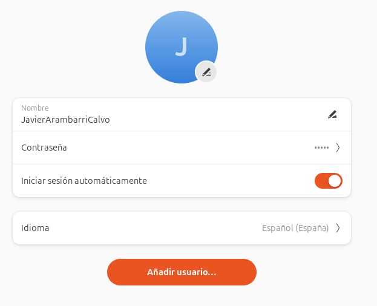

# VNC to a server running nvidia_isaac-sim_ros2_docker

Currently only available in Spanish... sorry :(

# Configuración de x11vnc con Xorg Dummy en Ubuntu

## 0.1 Iniciar sesión automáticamente
Es necesario que inicie sesión automáticamente en el usuario deseado, de lo contrario, no se cargará el entorno gráfico y no se podrá acceder por X11VNC (solo por Remote Login y TigerVNC, que no sirven para ejecutar Isaac Sim).

Configuración > Sistema > Usuarios:



## 0.2 Instalar, configurar y conectarse por SSH
```bash
sudo apt update
sudo apt install openssh-server
```

```bash
sudo systemctl status ssh
```
Debe aparecer como active (running).

Habilitar SSH para que arranque automáticamente:
```bash
sudo systemctl enable ssh
```

Habilitar el puerto 22 en el firewall y reiniciarlo:
```bash
sudo ufw allow 22/tcp
sudo ufw reload
```

Conexión SSH desde otro host:
```bash
ssh USER_REMOTE@IP_DIRECTION
```

Por seguridad, lo ideal sería añadir claves públicas de forma que solo nos podamos conectar con determinadas claves SSH, pero de momento lo vamos a dejar así.


## 1. Instalar paquetes necesarios
```bash
sudo apt update
sudo apt install x11vnc xserver-xorg-video-dummy
```
## 2. Crear configuración de Xorg dummy
```bash 
sudo nano /etc/X11/xorg.conf.d/10-headless.conf
```
Contenido del fichero de configuración:
```
Section "Device"
    Identifier  "Configured Video Device"
    Driver      "dummy"
    VideoRam    256000
EndSection

Section "Monitor"
    Identifier  "Configured Monitor"
    HorizSync   5.0 - 1000.0
    VertRefresh 5.0 - 200.0
    ModeLine "1920x1080" 148.50 1920 2448 2492 2640 1080 1084 1089 1125 +Hsync +Vsync
EndSection

Section "Screen"
    Identifier  "Default Screen"
    Monitor     "Configured Monitor"
    Device      "Configured Video Device"
    DefaultDepth 24
    SubSection "Display"
        Depth 24
        Modes "1920x1080" "1440x900" "1280x800" "1024x768"
    EndSubSection
EndSection
```

## 3. Configurar contraseña para VNC
```bash
mkdir -p ~/.vnc
x11vnc -storepasswd
```
Esto generará el archivo ``~/.vnc/passwd``.


## 4. Crear servicio systemd para x11vnc
```bash
sudo nano /etc/systemd/system/x11vnc.service
```
Contenido del servicio:
```
[Unit]
Description=Start x11vnc at startup
After=multi-user.target

[Service]
Type=simple
User=isaac_sim_1
Environment=DISPLAY=:0
ExecStart=/usr/bin/x11vnc -display :0 -forever -loop -noxdamage -repeat \
  -rfbauth /home/isaac_sim_1/.vnc/passwd -rfbport 5900 -shared
Restart=on-failure
RestartSec=5

[Install]
WantedBy=multi-user.target
```

## 5. Recargar systemd y habilitar servicio
```bash
sudo systemctl daemon-reload
sudo systemctl enable x11vnc.service
sudo systemctl start x11vnc.service
```

## 6. Verificar estado
```bash
sudo systemctl status x11vnc.service
``` 
Si necesitas comprobar qué display está activo:
```bash
echo $DISPLAY
ps aux | grep Xorg
```

## 7. (Opcional) Reiniciar Xorg dummy manualmente
En caso de problemas:
```bash
sudo pkill Xorg 2>/dev/null || true
DISPLAY=:0 startx -- -config /etc/X11/xorg.conf.d/10-headless.conf &
sudo systemctl restart x11vnc.service
```

## 8. Desactivar dummy y activar monitor físico
Acceder por SHH:
```bash
ssh USER_REMOTE@IP_DIRECTION
```

Renombrar el fichero de configuración del dummy. Hay que quitar la extesnión ``.conf``, ya que Xorg carga la configuración de todos los ficheros con esa terminación:
```bash
sudo mv /etc/X11/xorg.conf.d/10-headless.conf /etc/X11/xorg.conf.d/10-headless.conf.bkp
```

Reiniciamos:
```bash
sudo reboot
```

## 9. Activar dummy y desactivar monitor físico
Acceder por SHH:
```bash
ssh USER_REMOTE@IP_DIRECTION
```

Renombrar el fichero de configuración del dummy. Hay que poner la extesnión ``.conf``, ya que Xorg carga la configuración de todos los ficheros con esa terminación:
```bash
sudo mv /etc/X11/xorg.conf.d/10-headless.conf.bkp /etc/X11/xorg.conf.d/10-headless.conf
```

Reiniciamos:
```bash
sudo reboot
```